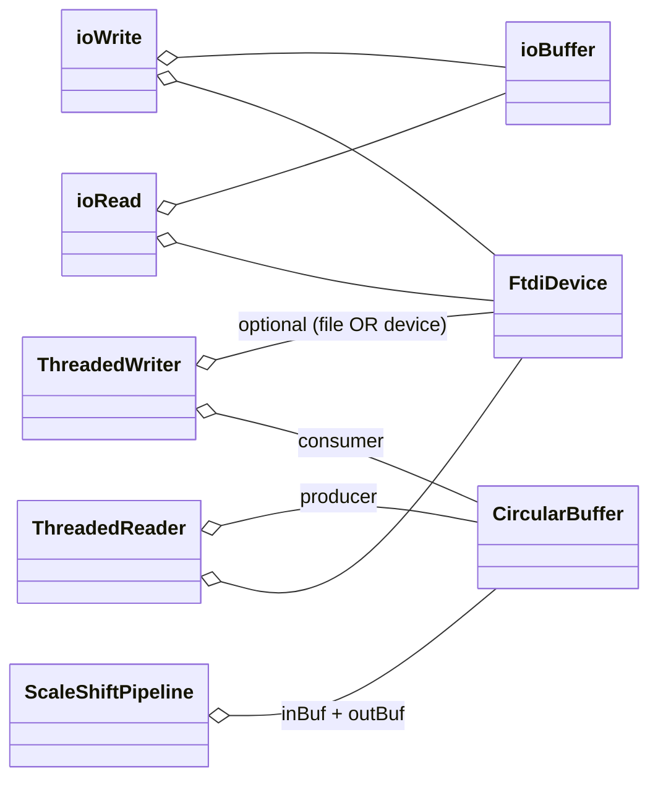
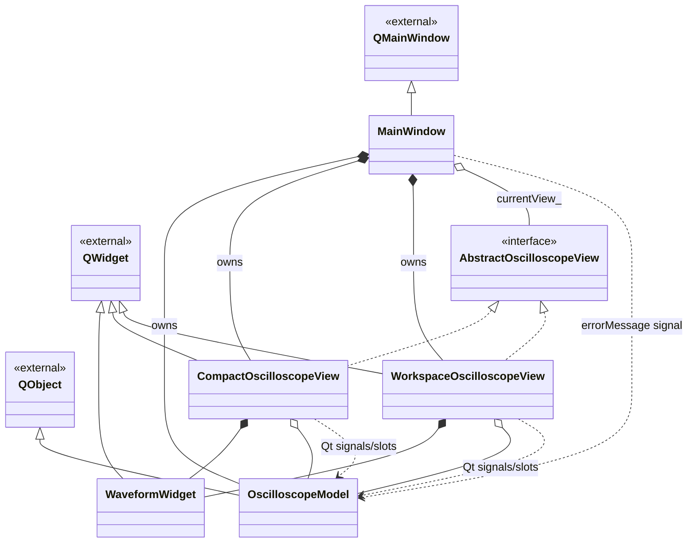

# Class Diagram

Mermaid class diagram generated from `class_implementation.md`. Render in any Markdown viewer with Mermaid support (GitHub, VS Code with Mermaid preview, etc.).

For **PlantUML** versions, the diagrams are split into 6 files (one focused concern each) under this directory:

| # | File | Scope |
|---|------|-------|
| 01 | `class_diagram_01_overview.puml`            | Package-level overview of the three layers |
| 02 | `class_diagram_02_iolib_singlethread.puml`  | ioLibrary single-threaded layer (FtdiDevice, ioBuffer, ioRead, ioWrite) |
| 03 | `class_diagram_03_iolib_pipeline.puml`      | ioLibrary multithreaded pipeline (CircularBuffer, ThreadedReader/Writer, ScaleShiftPipeline) |
| 04 | `class_diagram_04_model.puml`               | Qt MVC — OscilloscopeModel and what it owns |
| 05 | `class_diagram_05_views.puml`               | Qt MVC — AbstractOscilloscopeView + two concrete views + WaveformWidget |
| 06 | `class_diagram_06_controller.puml`          | Qt MVC — MainWindow wiring (view switching + error signal) |

Notation recap (Mermaid):

| Arrow | Meaning |
|---|---|
| `<|--` | Inheritance (child `--|>` parent; Mermaid draws `Parent <|-- Child`). |
| `*--`  | Composition (owner `*--` owned; strong lifetime). |
| `o--`  | Aggregation (holder `o--` referenced; weak, non-owning). |
| `-->`  | Usage / dependency (transient reference, signal/slot, callback). |

---

## 1. Full project diagram

```mermaid
classDiagram
    direction LR

    %% =========================
    %% ioLibrary (C++ static lib)
    %% =========================
    class FtdiDevice {
        -FT_HANDLE handle
        -mutex accessMutex
        +open(int deviceIndex) FT_STATUS
        +close() FT_STATUS
        +read(BYTE*, size_t) FT_STATUS
        +write(BYTE*, size_t) FT_STATUS
    }

    class ioBuffer {
        -BYTE* storage
        -size_t length
        +create(size_t) int
        +data() BYTE*
        +size() size_t
        +destroy() void
    }

    class ioRead {
        -FtdiDevice* device
        -ioBuffer* buffer
        -size_t N
        -double frequencyHz
        +configure(ioBuffer*, size_t, double) void
        +readLoop(int cycles) FT_STATUS
    }

    class ioWrite {
        -FtdiDevice* device
        -ioBuffer* buffer
        -size_t M
        -double frequencyHz
        +configure(ioBuffer*, size_t, double) void
        +writeLoop(int cycles) FT_STATUS
    }

    class CircularBuffer {
        -BYTE* storage
        -size_t capacity
        -size_t head
        -size_t tail
        -size_t count
        -mutex mtx
        -condition_variable notEmpty
        -condition_variable notFull
        -bool finished
        +write(const BYTE*, size_t) bool
        +read(BYTE*, size_t) bool
        +setDone() void
        +getCount() size_t
        +getCapacity() size_t
    }

    class ThreadedReader {
        -FtdiDevice* device
        -CircularBuffer* circBuffer
        -size_t N
        -double frequencyHz
        -thread readerThread
        -atomic_bool running
        +configure(CircularBuffer*, size_t, double) void
        +start() void
        +stop() void
        -threadFunc() void
    }

    class ThreadedWriter {
        -FtdiDevice* device
        -CircularBuffer* circBuffer
        -FILE* outputFile
        -size_t M
        -double frequencyHz
        -thread writerThread
        -atomic_bool running
        +ThreadedWriter(FtdiDevice*)
        +ThreadedWriter(const char* filePath)
        +configure(CircularBuffer*, size_t, double) void
        +start() void
        +stop() void
        -threadFunc() void
    }

    class ScaleShiftPipeline {
        -CircularBuffer* inBuf
        -CircularBuffer* outBuf
        -SampleCallback callback
        -thread worker
        -atomic_bool running
        -uint64_t sampleCounter
        +atomic~double~ scale
        +atomic~double~ shift
        +atomic~bool~ blinkDb0
        +setSampleCallback(SampleCallback) void
        +start() void
        +stopJoin() void
        -threadFunc() void
    }

    %% =========================
    %% Qt UI layer
    %% =========================
    class QObject { <<external Qt>> }
    class QWidget { <<external Qt>> }
    class QMainWindow { <<external Qt>> }

    class OscilloscopeModel {
        -atomic_bool running_
        -double scaleValue_
        -double shiftValue_
        -double sampleHz_
        -int rawBufferSize_
        -int readDeviceIndex_
        -int writeDeviceIndex_
        -bool dualFtdiOutput_
        -bool writeBackToReadDevice_
        -bool blinkDb0_
        -unique_ptr~FtdiDevice~ readDevice_
        -unique_ptr~FtdiDevice~ writeDevice_
        -unique_ptr~CircularBuffer~ rawBuffer_
        -unique_ptr~CircularBuffer~ processedBuffer_
        -ThreadedReader* reader_
        -ScaleShiftPipeline* pipeline_
        -ThreadedWriter* writer_
        -QVector~double~ displaySamples_
        -QMutex displayMutex_
        +startAcquisition() void
        +stopAcquisition() void
        +setScale/Shift/SampleHz/... (setters)
        #samplesUpdated(QVector~double~) signal
        #logLine(QString) signal
        #errorMessage(QString) signal
    }

    class AbstractOscilloscopeView {
        <<interface>>
        +asWidget() QWidget*
        +viewTitle() QString
        +bindModel(OscilloscopeModel*) void
        +unbindModel() void
    }

    class WaveformWidget {
        -QVector~double~ samples_
        +setSamples(const QVector~double~&) void
        #paintEvent(QPaintEvent*) void
    }

    class CompactOscilloscopeView {
        -OscilloscopeModel* model_
        -WaveformWidget* waveform_
        -QTextEdit* log_
        -QDoubleSpinBox* scaleSpin_
        -QDoubleSpinBox* shiftSpin_
        -QDoubleSpinBox* hzSpin_
        -QSpinBox* bufferSpin_
        -QSpinBox* readIndexSpin_
        -QSpinBox* writeIndexSpin_
        -QCheckBox* dualFtdiCheck_
        -QCheckBox* writeBackCheck_
        -QCheckBox* blinkDb0Check_
        -QPushButton* startButton_
        -QPushButton* stopButton_
        +bindModel(OscilloscopeModel*) void
        +unbindModel() void
        +onSamplesUpdated(QVector~double~) slot
        +onLogLine(QString) slot
    }

    class WorkspaceOscilloscopeView {
        -OscilloscopeModel* model_
        -WaveformWidget* waveform_
        -QTextEdit* log_
        -QDoubleSpinBox* scaleSpin_
        -QDoubleSpinBox* shiftSpin_
        -QDoubleSpinBox* hzSpin_
        -QSpinBox* bufferSpin_
        -QSpinBox* readIndexSpin_
        -QSpinBox* writeIndexSpin_
        -QCheckBox* dualFtdiCheck_
        -QCheckBox* writeBackCheck_
        -QCheckBox* blinkDb0Check_
        -QPushButton* startButton_
        -QPushButton* stopButton_
        +bindModel(OscilloscopeModel*) void
        +unbindModel() void
        +onSamplesUpdated(QVector~double~) slot
        +onLogLine(QString) slot
    }

    class MainWindow {
        -OscilloscopeModel* model_
        -QStackedWidget* stack_
        -AbstractOscilloscopeView* compactView_
        -AbstractOscilloscopeView* workspaceView_
        -AbstractOscilloscopeView* currentView_
        +showCompactView() slot
        +showWorkspaceView() slot
        +onModelError(QString) slot
    }

    %% =========================
    %% Inheritance
    %% =========================
    QObject <|-- OscilloscopeModel
    QWidget <|-- WaveformWidget
    QWidget <|-- CompactOscilloscopeView
    QWidget <|-- WorkspaceOscilloscopeView
    AbstractOscilloscopeView <|.. CompactOscilloscopeView
    AbstractOscilloscopeView <|.. WorkspaceOscilloscopeView
    QMainWindow <|-- MainWindow

    %% =========================
    %% Composition (ownership)
    %% =========================
    OscilloscopeModel   *-- FtdiDevice          : owns (unique_ptr x2)
    OscilloscopeModel   *-- CircularBuffer      : owns (unique_ptr x2)
    OscilloscopeModel   *-- ThreadedReader      : owns (new/delete)
    OscilloscopeModel   *-- ScaleShiftPipeline  : owns (new/delete)
    OscilloscopeModel   *-- ThreadedWriter      : owns (new/delete)

    MainWindow          *-- OscilloscopeModel          : owns (QObject parent)
    MainWindow          *-- CompactOscilloscopeView    : owns (Qt child)
    MainWindow          *-- WorkspaceOscilloscopeView  : owns (Qt child)

    CompactOscilloscopeView    *-- WaveformWidget : owns (Qt child)
    WorkspaceOscilloscopeView  *-- WaveformWidget : owns (Qt child)

    %% =========================
    %% Aggregation (non-owning pointers)
    %% =========================
    ioRead             o-- FtdiDevice      : device*
    ioRead             o-- ioBuffer        : buffer*
    ioWrite            o-- FtdiDevice      : device*
    ioWrite            o-- ioBuffer        : buffer*

    ThreadedReader     o-- FtdiDevice      : device*
    ThreadedReader     o-- CircularBuffer  : circBuffer* (producer)
    ThreadedWriter     o-- FtdiDevice      : device* (optional)
    ThreadedWriter     o-- CircularBuffer  : circBuffer* (consumer)
    ScaleShiftPipeline o-- CircularBuffer  : inBuf* + outBuf*

    CompactOscilloscopeView    o-- OscilloscopeModel : model_ (alias)
    WorkspaceOscilloscopeView  o-- OscilloscopeModel : model_ (alias)
    MainWindow o-- AbstractOscilloscopeView          : currentView_ (alias)

    %% =========================
    %% Usage / dependency
    %% =========================
    OscilloscopeModel       ..> ScaleShiftPipeline : setSampleCallback (posts QueuedConnection)
    CompactOscilloscopeView   ..> OscilloscopeModel : signals/slots, setters
    WorkspaceOscilloscopeView ..> OscilloscopeModel : signals/slots, setters
    MainWindow                ..> OscilloscopeModel : errorMessage -> onModelError
    CompactOscilloscopeView   ..> WaveformWidget   : setSamples()
    WorkspaceOscilloscopeView ..> WaveformWidget   : setSamples()
```



---

## 2. ioLibrary-only view (pipeline internals)



Data flow implied by the aggregations above:

```
FtdiDevice(read) ──► ThreadedReader ──► rawBuffer ──► ScaleShiftPipeline
                                                          │
                                                          ▼
                                                   processedBuffer
                                                          │
                                                          ▼
                                                  ThreadedWriter ──► FtdiDevice(write) or FILE
```

---

## 3. Qt MVC-only view


